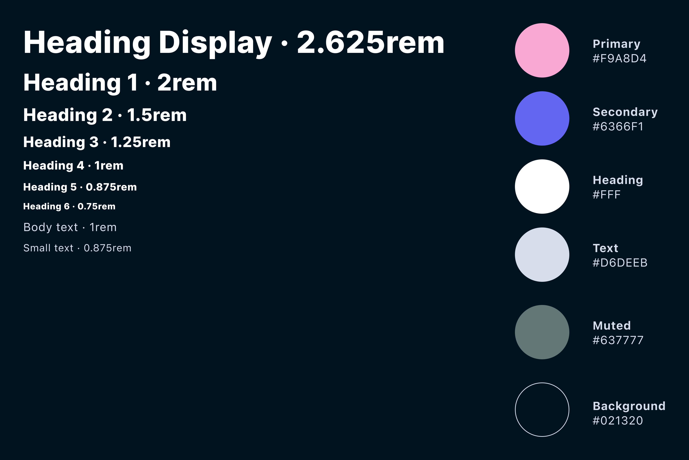
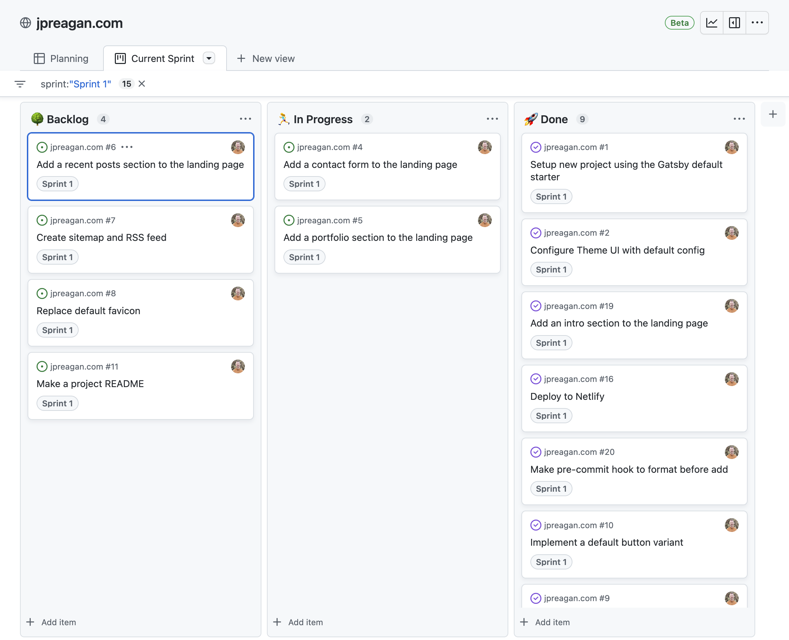

In pursuit of my first full-time role as a developer, I needed a portfolio to show case my work. This task can easily be accomplished with a simple landing page using HTML, CSS, and JavaScript, but I wanted a bit more functionality and like playing with new things also so I considered various options.

There is a fantastic modern class of technology in the JavaScript world often referred to as the JAMstack. The JAMstack uses JavaScript, APIs, and static markup to make performant websites. There is a [plethora of options](https://jamstack.org/) to choose from with the JAMstack.

At the most basic level, JAMstack tools are static site generators (SSG) like popular predecessors such as Jekyll, but capable of a lot more too. I've been tinkering with a few of them lately, particularly [Next.js](https://nextjs.org/) which really blurs the line between client and server capabilities, but for this particular project I decided to change it up a bit in the spirit of learning something new.

Feeling at home with React, I chose [Gatsby](https://www.gatsbyjs.com/) with the idea in mind that I'd also want to blog my journey. Gatsby makes this fun and super easy with MDX and using it's internal GraphQL API so that you can write posts in markdown and include React components as needed too.

Gatsby is a great choice with a reputation for the following:
- Performance
- Accessibility
- Developer experience (DX)
- Security

These are all important considerations for me especially the first two: performance and accessibility. You get perfect search engine optimization (SEO) out of the box too, which is fantastic for blogging and people finding you. Pretty much exactly what you want in a portfolio!

## Design

The first thing I needed to do is sketch something out in Figma. On projects in which I'm responsible for the design, I've found it's so much better for me to start out with a design tool. Design is a creative process and that shouldn't be burdened by writing code in the beginning.

For theme inspiration, I absolutely love Sarah Drasner's [Night Owl Theme](https://github.com/sdras/night-owl-vscode-theme) for Visual Studio Code. I knew at least the code blocks would use this theme via [Prism](https://prismjs.com/), but wanted the color scheme to jive with it as well.

```js
const hello = "colors that jive"
```

So, I implemented a design system defining the project colors. This is how it turned out.



I've been a long-time admirer of the [Inter](https://rsms.me/inter/) typeface. It's often my go-to font being so legible and beautiful. I decided to use it for the headings. There is a variable font for Inter as well, which is a big plus. Currently, it does not support variable width although I hear that is in the works. In the meantime, I like to tighten up the letter-spacing on headlines just a pinch with CSS.

Another design trend I've been all about recently is color gradients! I've been seeing them pop up everywhere, but I think Apple has used it the best I've seen yet. I just love how fabulous bright color gradients look with a dark theme background. I knew I was going to color gradient all the things.

So, I sketched up a landing page with all that in mind. Here is how the first mockup turned out.


## Planning

With a design in mind, my next step was to plan the project. I'm used to working collaboratively in an Agile environment with daily standups and sprints organized on a project board such as Trello. Experience has taught me that doing the same for solo projects is a very good idea too. My focus and productivity has increased a lot with that practice.

I noticed that GitHub Projects has a new Beta version that I was curious to try out, and I'm so glad that I did. It's wonderful! You can add an item to a sprint, convert it to an issue, and then it automatically gets marked "Done" when you close the issue. How cool is that?

There is advanced filtering capabilities and I normally keep two views open: (1) a [planning view](https://github.com/users/jpreagan/projects/1/views/1) with all sprints and tasks and (2) a [Kanban board](https://github.com/users/jpreagan/projects/1/views/1) for the current sprint. For me personally, this is the perfect solution for organizing a project and I predict it will just get better and better with time.


